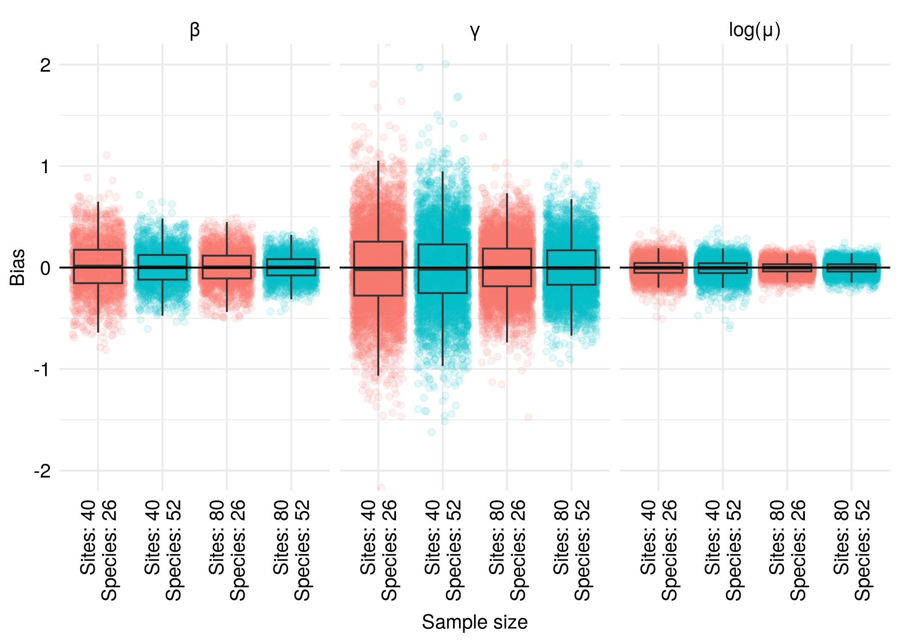
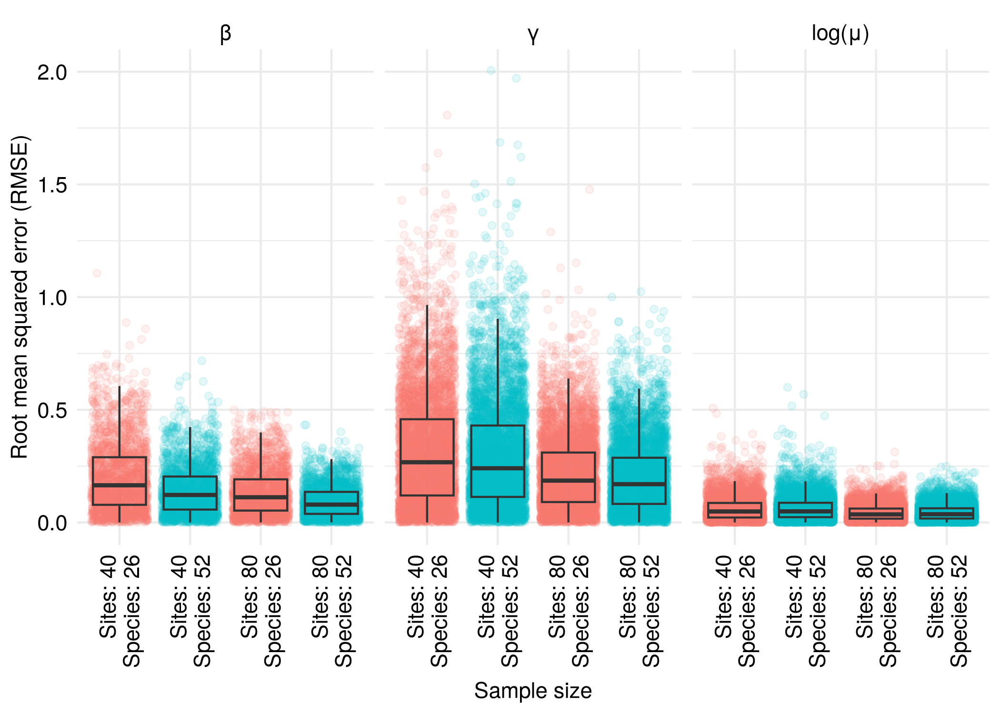
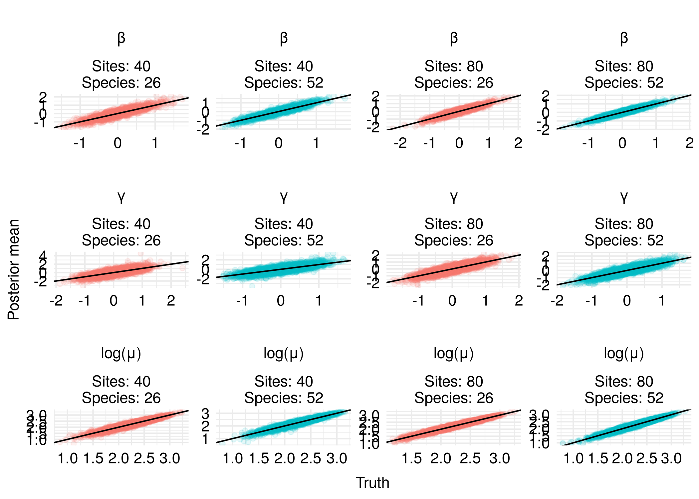
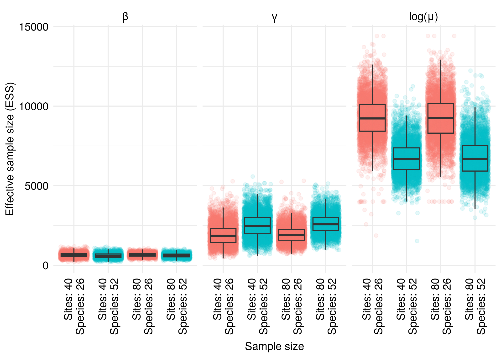
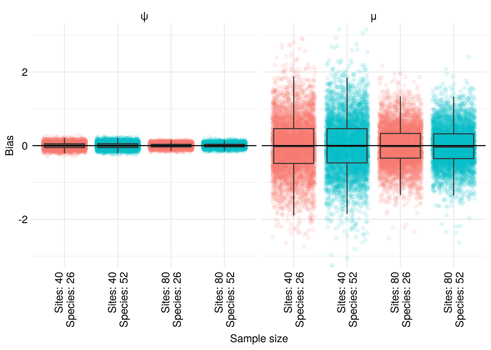
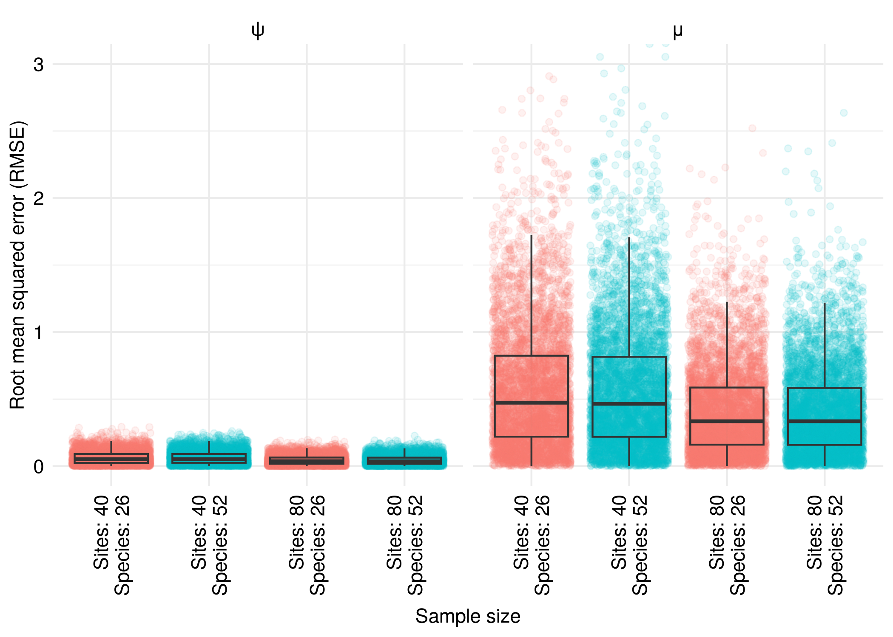
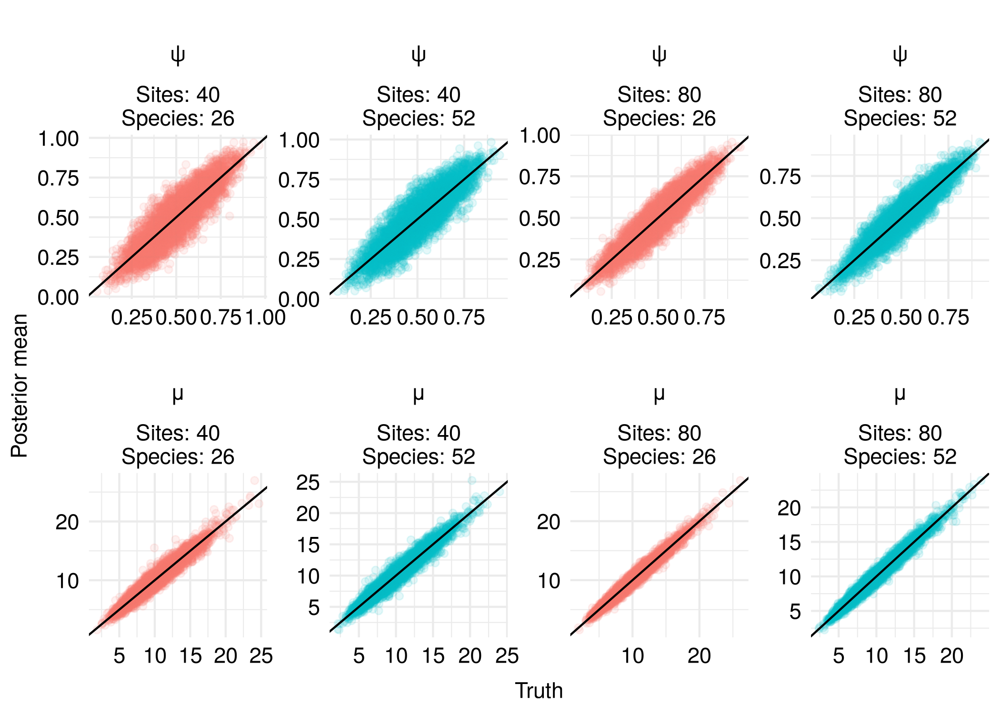
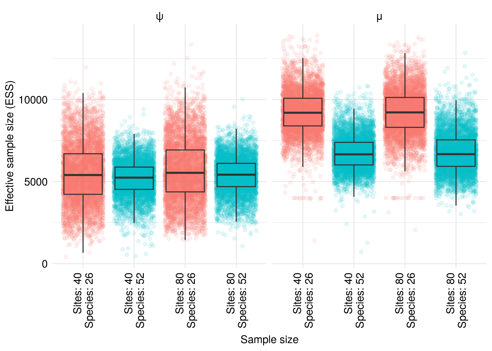
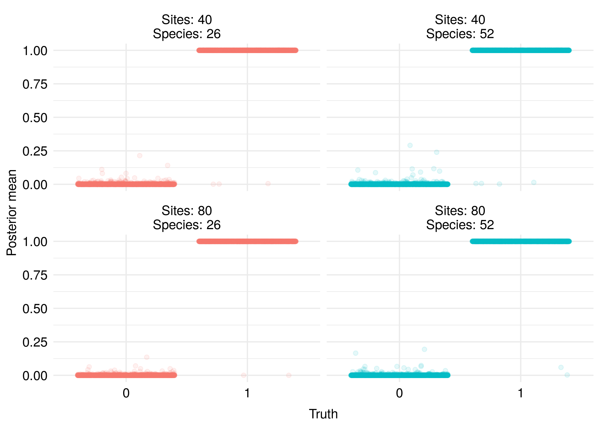

Simulation Study, Scenario 1, Evaluation
================
Hannes Riebl

``` r
library(dplyr)
```


    Attaching package: 'dplyr'

    The following objects are masked from 'package:stats':

        filter, lag

    The following objects are masked from 'package:base':

        intersect, setdiff, setequal, union

``` r
library(ggplot2)
library(here)
```

    here() starts at /home/hannes/ownCloud/Research/mscm

``` r
library(purrr)

set.seed(1337)

theme_set(theme_minimal())

theme_update(
  text = element_text(family = "TeX Gyre Heros"),
  axis.text = element_text(color = "black", size = rel(1.0)),
  axis.text.x = element_text(margin = margin(2.2, 0, 4.4, 0)),
  strip.text = element_text(color = "black", size = rel(1.0)),
  strip.text.x = element_text(vjust = 0.1),
)

red <- palette()[2]
vars <- c("eta_p0_beta", "gamma", "mu_transformed", "z", "psi", "mu")
jobs <- list.dirs(here("paper", "simulation-study", "scenario-1", "dont-sync"),
                  recursive = FALSE)

df <- list_rbind(map(jobs, function(job) {
  results <- readRDS(file.path(job, "results.rds"))

  stats <- map(
    .x = vars,
    .f = function(var) {
      truth <- if (var == "mu_transformed") {
        as.vector(log(results$truth[["mu"]]))
      } else {
        as.vector(results$truth[[var]])
      }

      pmean <- as.vector(results$summary$mean[[var]])
      pstddev <- as.vector(results$summary$sd[[var]])

      q <- results$summary$q[[var]]
      commas <- paste0(rep(",", length(dim(q)) - 1), collapse = "")
      q05 <- as.vector(eval(parse(text = paste0("q[1", commas, "]"))))
      q95 <- as.vector(eval(parse(text = paste0("q[3", commas, "]"))))
      covered <- q05 <= truth & truth <= q95

      ess <- as.vector(results$summary$ess_bulk[[var]])
      data.frame(var, truth, pmean, pstddev, covered, ess)
    }
  )

  cbind(as.data.frame(results$param), list_rbind(stats))
}))

df <- df %>%
  mutate(
    nboth = factor(paste0("Sites: ", nsites, "\nSpecies: ", nspecies)),
    var = factor(
      x = var,
      levels = c("eta_p0_beta", "gamma", "mu_transformed", "z", "psi", "mu"),
      labels = c("β", "γ", "log(μ)", "z", "ψ", "μ")
    ),
    bias = pmean - truth,
    rmse = sqrt(bias^2)
  )

p <- df %>%
  filter(var == "β" | var == "γ" | var == "log(μ)") %>%
  group_by(var, nboth) %>%
  slice_sample(n = 5000) %>%
  ungroup()

ggplot(p) +
  geom_jitter(aes(nboth, bias, color = as.factor(nspecies)), alpha = 0.1) +
  geom_boxplot(aes(nboth, bias), fill = NA, outlier.shape = NA) +
  geom_hline(yintercept = 0) +
  facet_wrap(vars(var)) +
  labs(x = "Sample size", y = "Bias") +
  scale_color_discrete(guide = "none") +
  coord_cartesian(ylim = c(-2, 2)) +
  theme(axis.text.x = element_text(angle = 90, vjust = 0.5, hjust = 1))
```



``` r
ggplot(p) +
  geom_jitter(aes(nboth, rmse, color = as.factor(nspecies)), alpha = 0.1) +
  geom_boxplot(aes(nboth, rmse), fill = NA, outlier.shape = NA) +
  facet_wrap(vars(var)) +
  labs(x = "Sample size", y = "Root mean squared error (RMSE)") +
  scale_color_discrete(guide = "none") +
  coord_cartesian(ylim = c(0, 2)) +
  theme(axis.text.x = element_text(angle = 90, vjust = 0.5, hjust = 1))
```



``` r
ggplot(p) +
  geom_point(aes(truth, pmean, color = as.factor(nspecies)), alpha = 0.1) +
  geom_abline(intercept = 0, slope = 1) +
  facet_wrap(vars(var, nboth), nrow = 3, scales = "free") +
  labs(x = "Truth", y = "Posterior mean") +
  scale_color_discrete(guide = "none")
```



``` r
ggplot(p) +
  geom_jitter(aes(nboth, ess, color = as.factor(nspecies)), alpha = 0.1) +
  geom_boxplot(aes(nboth, ess), fill = NA, outlier.shape = NA) +
  facet_wrap(vars(var)) +
  labs(x = "Sample size", y = "Effective sample size (ESS)") +
  scale_color_discrete(guide = "none") +
  theme(axis.text.x = element_text(angle = 90, vjust = 0.5, hjust = 1))
```



``` r
p <- df %>%
  filter(var == "ψ" | var == "μ") %>%
  group_by(var, nboth) %>%
  slice_sample(n = 5000) %>%
  ungroup()

ggplot(p) +
  geom_jitter(aes(nboth, bias, color = as.factor(nspecies)), alpha = 0.1) +
  geom_boxplot(aes(nboth, bias), fill = NA, outlier.shape = NA) +
  geom_hline(yintercept = 0) +
  facet_wrap(vars(var)) +
  labs(x = "Sample size", y = "Bias") +
  scale_color_discrete(guide = "none") +
  coord_cartesian(ylim = c(-3, 3)) +
  theme(axis.text.x = element_text(angle = 90, vjust = 0.5, hjust = 1))
```



``` r
ggplot(p) +
  geom_jitter(aes(nboth, rmse, color = as.factor(nspecies)), alpha = 0.1) +
  geom_boxplot(aes(nboth, rmse), fill = NA, outlier.shape = NA) +
  facet_wrap(vars(var)) +
  labs(x = "Sample size", y = "Root mean squared error (RMSE)") +
  scale_color_discrete(guide = "none") +
  coord_cartesian(ylim = c(0, 3)) +
  theme(axis.text.x = element_text(angle = 90, vjust = 0.5, hjust = 1))
```



``` r
ggplot(p) +
  geom_point(aes(truth, pmean, color = as.factor(nspecies)), alpha = 0.1) +
  geom_abline(intercept = 0, slope = 1) +
  facet_wrap(vars(var, nboth), nrow = 2, scales = "free") +
  labs(x = "Truth", y = "Posterior mean") +
  scale_color_discrete(guide = "none")
```



``` r
ggplot(p) +
  geom_jitter(aes(nboth, ess, color = as.factor(nspecies)), alpha = 0.1) +
  geom_boxplot(aes(nboth, ess), fill = NA, outlier.shape = NA) +
  facet_wrap(vars(var)) +
  labs(x = "Sample size", y = "Effective sample size (ESS)") +
  scale_color_discrete(guide = "none") +
  theme(axis.text.x = element_text(angle = 90, vjust = 0.5, hjust = 1))
```



``` r
p <- df %>%
  filter(var == "z") %>%
  group_by(var, nboth) %>%
  slice_sample(n = 5000) %>%
  ungroup()

ggplot(p) +
  geom_jitter(aes(as.factor(truth), pmean, color = as.factor(nspecies)), alpha = 0.1) +
  facet_wrap(vars(nboth)) +
  labs(x = "Truth", y = "Posterior mean") +
  scale_color_discrete(guide = "none")
```



``` r
df %>%
  group_by(var, nsites, nspecies) %>%
  summarize(bias = mean(bias), .groups = "drop") %>%
  knitr::kable(digits = 3)
```

| var    | nsites | nspecies |   bias |
|:-------|-------:|---------:|-------:|
| β      |     40 |       26 |  0.011 |
| β      |     40 |       52 |  0.003 |
| β      |     80 |       26 |  0.003 |
| β      |     80 |       52 |  0.000 |
| γ      |     40 |       26 | -0.010 |
| γ      |     40 |       52 | -0.004 |
| γ      |     80 |       26 | -0.003 |
| γ      |     80 |       52 |  0.000 |
| log(μ) |     40 |       26 | -0.006 |
| log(μ) |     40 |       52 | -0.006 |
| log(μ) |     80 |       26 | -0.003 |
| log(μ) |     80 |       52 | -0.003 |
| z      |     40 |       26 |  0.000 |
| z      |     40 |       52 |  0.000 |
| z      |     80 |       26 |  0.000 |
| z      |     80 |       52 |  0.000 |
| ψ      |     40 |       26 |  0.000 |
| ψ      |     40 |       52 |  0.000 |
| ψ      |     80 |       26 |  0.000 |
| ψ      |     80 |       52 |  0.000 |
| μ      |     40 |       26 | -0.004 |
| μ      |     40 |       52 | -0.003 |
| μ      |     80 |       26 | -0.005 |
| μ      |     80 |       52 | -0.007 |

``` r
df %>%
  group_by(var, nsites, nspecies) %>%
  summarize(coverage = mean(covered), .groups = "drop") %>%
  knitr::kable(digits = 3)
```

| var    | nsites | nspecies | coverage |
|:-------|-------:|---------:|---------:|
| β      |     40 |       26 |    0.875 |
| β      |     40 |       52 |    0.880 |
| β      |     80 |       26 |    0.885 |
| β      |     80 |       52 |    0.892 |
| γ      |     40 |       26 |    0.888 |
| γ      |     40 |       52 |    0.890 |
| γ      |     80 |       26 |    0.897 |
| γ      |     80 |       52 |    0.898 |
| log(μ) |     40 |       26 |    0.898 |
| log(μ) |     40 |       52 |    0.900 |
| log(μ) |     80 |       26 |    0.896 |
| log(μ) |     80 |       52 |    0.901 |
| z      |     40 |       26 |    1.000 |
| z      |     40 |       52 |    1.000 |
| z      |     80 |       26 |    1.000 |
| z      |     80 |       52 |    1.000 |
| ψ      |     40 |       26 |    0.889 |
| ψ      |     40 |       52 |    0.889 |
| ψ      |     80 |       26 |    0.896 |
| ψ      |     80 |       52 |    0.898 |
| μ      |     40 |       26 |    0.898 |
| μ      |     40 |       52 |    0.900 |
| μ      |     80 |       26 |    0.896 |
| μ      |     80 |       52 |    0.901 |

``` r
df %>%
  group_by(var) %>%
  summarize(
    q01 = quantile(truth, 0.01),
    q99 = quantile(truth, 0.99),
    .groups = "drop"
  ) %>%
  knitr::kable(digits = 3)
```

| var    |    q01 |    q99 |
|:-------|-------:|-------:|
| β      | -1.175 |  1.178 |
| γ      | -1.166 |  1.170 |
| log(μ) |  1.421 |  2.932 |
| z      |  0.000 |  1.000 |
| ψ      |  0.176 |  0.823 |
| μ      |  4.141 | 18.768 |
